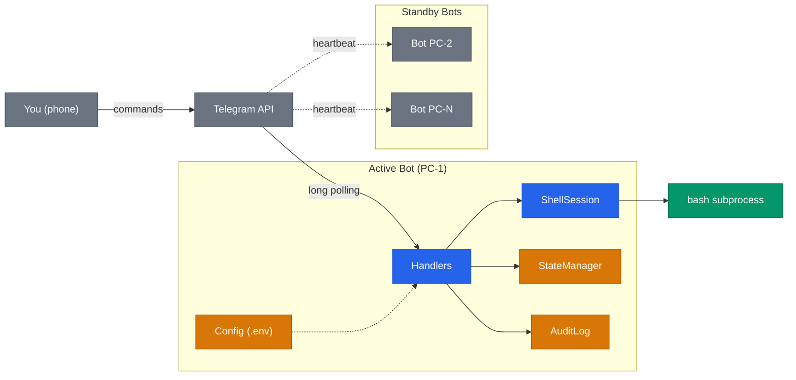

# Telegram Terminal Bot

> Control remote terminals from your smartphone via Telegram. Multi-PC, persistent sessions, zero infrastructure.

<div align="center">

[](https://github.com/AndreaBonn/remote-terminal-bot/actions/workflows/ci.yml)
[](https://github.com/AndreaBonn/remote-terminal-bot/actions/workflows/ci.yml)
[](https://github.com/AndreaBonn/remote-terminal-bot/actions/workflows/ci.yml)
[](https://github.com/astral-sh/ruff)
[](https://www.python.org/downloads/)
[](LICENSE)
[](SECURITY.md)

</div>

**[🇮🇹 Leggi in italiano](README.it.md)** | **[📖 Installation Guide](docs/how-to-install.md)** | **[🔒 Security](SECURITY.md)** | **[🤝 Contributing](CONTRIBUTING.md)**

---

## Why?

SSH from your phone is painful. VPNs require infrastructure. This bot gives you a full persistent shell on any of your machines — directly from Telegram.

**Key differentiator:** No central server. Telegram itself acts as the message bus. Multiple PCs share the same bot token, coordinate via heartbeat broadcast, and you switch between them with a single command.

## Architecture



Each PC runs the same bot token. Only the **active** PC executes commands. Others listen silently and track heartbeats to know who's online. See [Architecture docs](docs/ARCHITECTURE.md) for detailed sequence diagrams and state machines.

## Features

- **Persistent shell** — working directory and environment survive between commands
- **Multi-PC switching** — `/activate desktop`, `/activate laptop`, instant switch
- **Peer discovery** — automatic via Telegram heartbeat (no DNS, no ports, no VPN)
- **Timeout protection** — commands killed after configurable timeout, session auto-respawns
- **Rate limiting** — max 30 commands/minute, output capped at 512KB
- **Security** — single authorized chat ID, no `shell=True`, systemd hardened
- **Zero dependencies** beyond Python and Telegram

## Quick Start

### Prerequisites

- Python 3.10+
- A Telegram bot token (from [@BotFather](https://t.me/BotFather))
- Your chat ID (from [@userinfobot](https://t.me/userinfobot))

### Install

```bash
# Clone
git clone https://github.com/AndreaBonn/remote-terminal-bot.git
cd remote-terminal-bot

# Install (recommended: uv)
uv sync

# Or use the automated installer
./scripts/install.sh
```

### Configure

```bash
cp .env.example .env
nano .env
```

```env
TELEGRAM_BOT_TOKEN=your_bot_token_here
AUTHORIZED_CHAT_ID=your_chat_id_here
MACHINE_NAME=my-desktop
COMMAND_TIMEOUT=30
HEARTBEAT_INTERVAL=60
```

### Run

```bash
# Direct
uv run python -m src.bot

# Or as systemd service (auto-start on boot)
sudo systemctl enable --now telegram-terminal-bot@$USER
```

## Usage

| Command | Description |
|---------|-------------|
| `/activate <name>` | Switch active PC |
| `/list` | Show online PCs with last heartbeat |
| `/status` | Current PC and working directory |
| `/cancel` | Send SIGINT to running command |
| `/help` | Show available commands |
| *any text* | Execute as shell command on active PC |

### Example session

```
You: /activate desktop
Bot: ✅ PC attivo: desktop

You: pwd
Bot: /home/user

You: ls -la ~/projects
Bot: [output...]

You: /activate laptop
Bot: ✅ PC attivo: laptop

You: docker ps
Bot: [output from laptop...]
```

## Security Model

| Layer | Protection |
|-------|-----------|
| Authorization | Single `AUTHORIZED_CHAT_ID` — only your chat can execute commands |
| Rate limiting | Max 30 commands/minute |
| Output cap | 512KB max per command output (prevents OOM) |
| Timeout | Configurable per-command timeout with SIGKILL escalation |
| Systemd | `NoNewPrivileges`, `ProtectSystem=strict`, kernel tunable protection |
| Secrets | Bot token in `.env` with `chmod 600`, never logged |

> **Important:** This bot provides full shell access. The security boundary is your Telegram account. Enable 2FA on Telegram and keep your `.env` file secure.

## Project Structure

```
src/
├── bot.py              # Application lifecycle, heartbeat, polling
├── config.py           # Immutable settings from .env
├── handlers.py         # Telegram command handlers (DI via closure)
├── shell_session.py    # Persistent bash subprocess management
├── state_manager.py    # Multi-PC coordination
└── utils.py            # Message formatting and splitting
tests/                  # Unit and integration tests
scripts/install.sh      # Automated installer
systemd/                # Service template for multi-user deployment
```

## Design Decisions

1. **DI via closure** — `create_handlers()` injects dependencies without a DI framework
2. **Telegram as message bus** — heartbeats are regular messages, filtered and deleted. Zero infrastructure.
3. **End marker pattern** — commands are delimited by a cryptographic marker (`secrets.token_hex(16)`) to reliably parse output boundaries
4. **Atomic state writes** — `state.json` uses write-tmp-then-rename to prevent corruption
5. **Process group isolation** — `start_new_session=True` enables clean SIGKILL of entire process trees on timeout

## Why not Docker?

It is technically possible to run the bot in a container with `--pid=host`, `--network=host`, and the host filesystem bind-mounted — but at that point the container provides almost no isolation while adding an extra runtime to install, secure, and update.

The actual reason this project chose `systemd` over Docker is fit-for-purpose: the kernel-level hardening directives used here (`ProtectSystem=strict`, `CapabilityBoundingSet=`, `SystemCallFilter=@system-service`, `RestrictNamespaces=true`) give a tighter, narrower sandbox than a permissive container needs to be in order to still do its job. systemd is also already present on every target host, so there is zero added attack surface from the orchestration layer itself.

Containers would be the right call if the bot had to be deployable across heterogeneous hosts or scheduled by an orchestrator. Neither is the case here.

## Development

```bash
# Install dev dependencies
uv sync

# Run tests
uv run pytest

# Run tests with coverage
uv run pytest --cov --cov-report=term-missing

# Lint
uv run ruff check .
uv run ruff format --check .
```

## Support the Project

If you find this bot useful, consider giving it a star on GitHub — it helps others discover the project and motivates further development.

[](https://github.com/AndreaBonn/remote-terminal-bot)

Telegram Terminal Bot is free to use. If it helps you and you want to give something back, you can leave a tip via PayPal. The amount is up to you and it is entirely optional.

<div align="center">

[](https://paypal.me/AndreaBonacci19)

</div>

## License

[MIT](LICENSE) — Copyright (c) 2026 [Andrea Bonacci](https://github.com/AndreaBonn)
