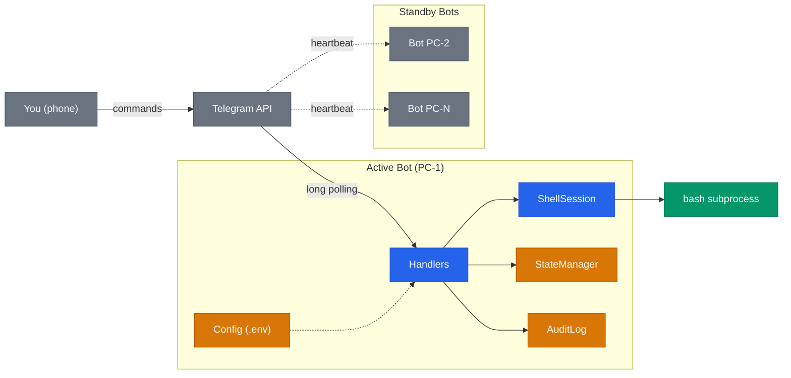
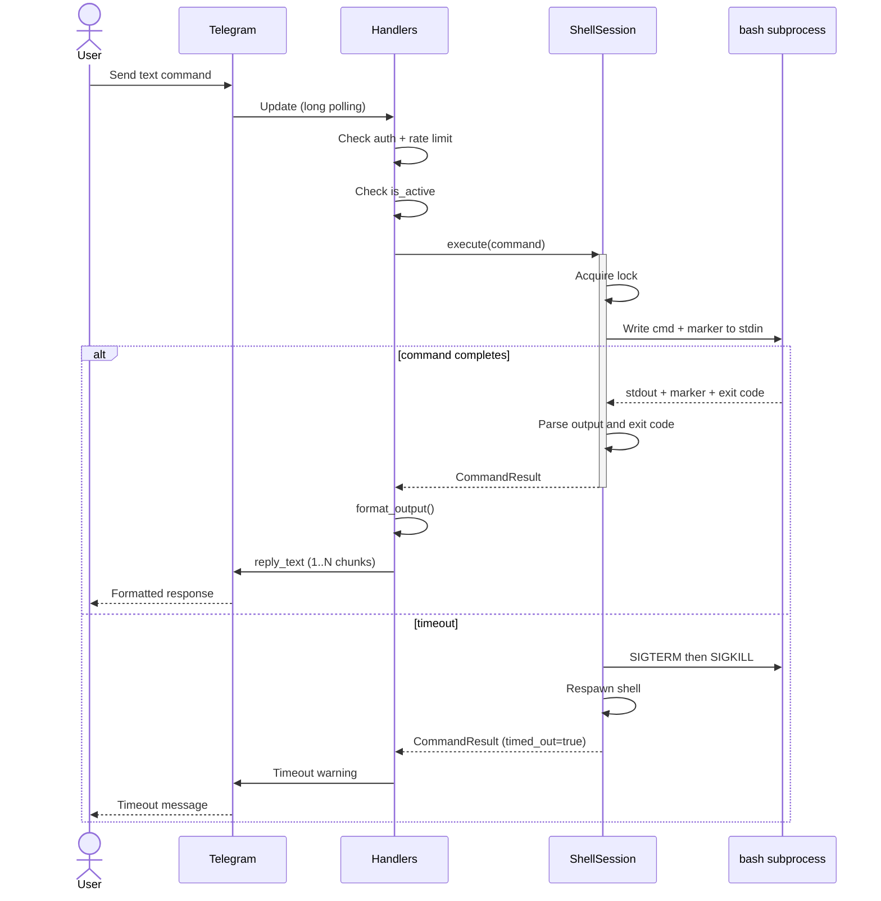
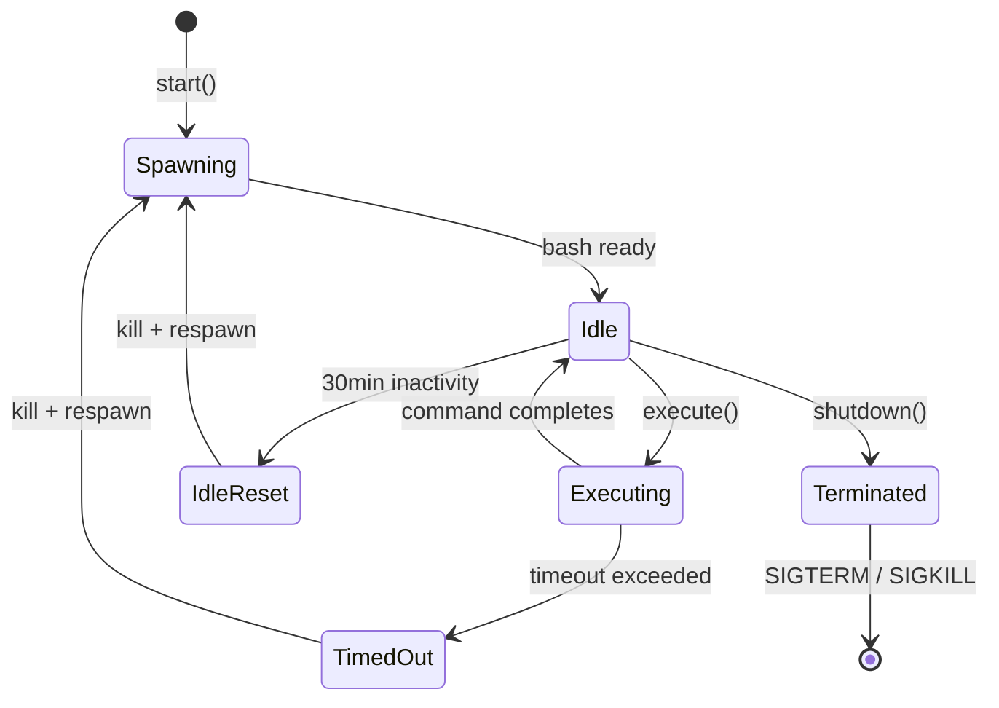
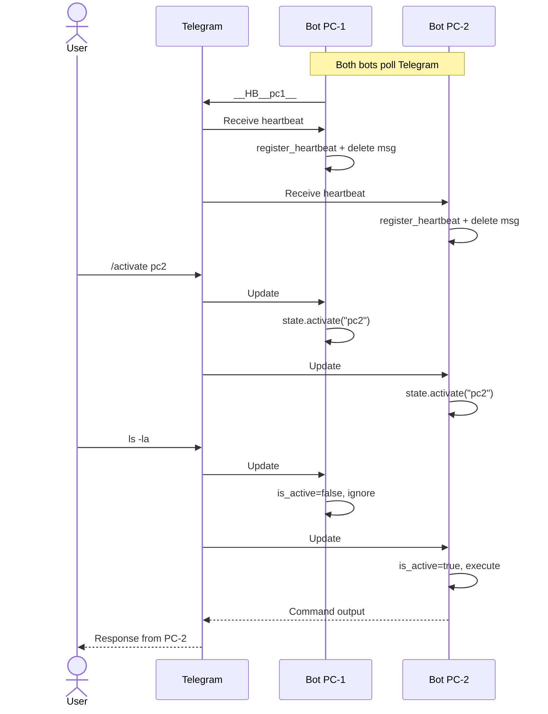

# Architecture

Technical reference for the Telegram Terminal Bot internals. For usage and setup, see [README](../README.md).

## System Overview

The bot runs as a long-polling Telegram client. Multiple instances share the same bot token, but only one (the **active** PC) executes shell commands. Others stay in standby, tracking peers via heartbeat messages.

**Color legend:** blue = core logic, amber = data/config, green = external process, grey = external services.

## Command Execution Flow

Every text message (non-command) goes through this pipeline. The handler validates authorization, checks rate limits, confirms this PC is the active one, then delegates to `ShellSession`. The session writes the command plus a cryptographic end marker to the bash subprocess stdin, reads stdout until the marker appears, and parses the exit code.

Key details:
- The `asyncio.Lock` prevents concurrent command execution on the same session
- Output exceeding 512KB is truncated
- Responses longer than 4000 chars are split into multiple Telegram messages
- On timeout, the entire process group is killed (`os.killpg`) and the shell is respawned

## Shell Session Lifecycle

The bash subprocess follows this state machine. It spawns on startup, sits idle between commands, and auto-resets after 30 minutes of inactivity to limit the exposure window.

The shell is spawned with `--norc --noprofile` in its own process group (`start_new_session=True`). This ensures clean signal delivery and prevents user RC scripts from interfering.

## Multi-PC Coordination

Multiple bots share the same Telegram bot token. Coordination happens through Telegram itself: heartbeat messages for peer discovery, `/activate` for switching the active PC. No external infrastructure needed.

Key details:
- Heartbeat messages use the format `__HB__<machine_name>__` and are deleted after processing
- Peers with no heartbeat for >120 seconds are considered offline
- State is persisted to `~/.local/share/telegram-terminal-bot/state.json` via atomic write (tmp + rename)
- When a PC receives a command but `is_active=false`, it silently ignores it
